<div align="center">

# 🥬 FoodRescue

**Food with a destination.**

A marketplace that finds a commercial or social outlet for agricultural surplus before it becomes
waste — with payment held in a Solana escrow that only releases against confirmed delivery.

`Laravel 13` · `PHP 8.3+` · `PostgreSQL 17` · `Solana (native Rust, no Anchor)` · `Ed25519`

[Whitepaper](docs/WHITEPAPER.md) · [Yellowpaper](docs/YELLOWPAPER.md) · [Domain docs](www/docs/) · [Code review](www/docs/CODE_REVIEW.md)

</div>

---

## The problem

Roughly a third of what Brazil harvests never reaches anyone. Much of that waste isn't pests and it
isn't logistics: it's **the absence of a trustworthy counterparty at the right moment**. A grower has
40 tonnes of tomatoes with five days of shelf life and no channel to move them; a buyer won't prepay a
stranger; an NGO can't guarantee anyone that the freight will be paid; a carrier won't roll without
certainty of payment.

Everyone wants the same deal, and nobody can afford to trust first.

## The solution

FoodRescue takes trust out of the equation. The buyer deposits into an **on-chain escrow**; the money
sits in a vault that nobody controls — not even the platform. Release is automatic and atomic once
delivery is confirmed: grower, carrier and protocol are all paid in the same transaction.

```
                    ┌──────────────────────────────────────────┐
                    │  Vault PDA — nobody holds the key        │
   Buyer ──────────▶│  authority = trade PDA                  │──────▶ Grower  (product − fee)
   deposits         │  balance = product + freight            │──────▶ Carrier (freight)
   FRUSD            └──────────────────────────────────────────┘──────▶ Treasury (2%)
                            releases only in `delivered`
```

**The backend never signs anything.** It assembles the instruction, hands it to the actor's own wallet
(Phantom or compatible) to sign, and then **verifies the result on chain** byte for byte against what
was promised. There is no private key on the server.

## Actors

| Actor | What they do |
|---|---|
| 🌱 **Grower** | Signs and publishes the surplus, accepts offers, marks ready for pickup |
| 🛒 **Buyer** | Bids or buys outright, funds the escrow, confirms receipt, settles |
| 🚚 **Carrier** | Quotes freight in an open quotation market, confirms pickup |
| 🤝 **NGO** | Receives a lot as a donation, pays only freight, attests the *Proof of Rescue* |
| 🛡️ **Admin** | Reference catalogue, operational deadlines, on-chain `ProtocolConfig` |

## Life of a trade

```mermaid
flowchart LR
    A[reserved] --> B[logistics]
    B --> C[waiting_payment]
    C --> D[funded]
    D --> E[ready_for_pickup]
    E --> F[in_transit]
    F --> G[delivered]
    G --> H[proof_pending]
    H --> I[completed]
    G --> I

    style A fill:#f5f7ef,stroke:#dce4dc,color:#17211d
    style B fill:#f5f7ef,stroke:#dce4dc,color:#17211d
    style C fill:#f2b94b,stroke:#f2b94b,color:#17211d
    style D fill:#123c2d,stroke:#1c563f,color:#f5f7ef
    style E fill:#1c563f,stroke:#1c563f,color:#f5f7ef
    style F fill:#1c563f,stroke:#1c563f,color:#f5f7ef
    style G fill:#1c563f,stroke:#1c563f,color:#f5f7ef
    style H fill:#8769d2,stroke:#8769d2,color:#ffffff
    style I fill:#c9ef77,stroke:#a8d950,color:#123c2d
```



Everything up to `waiting_payment` happens in the UI. From there on, each step requires a transaction
signed on Solana — the screen shows who signs and what. `proof_pending` only appears for donations
with freight, where the NGO and the grower attest the rescue in two independent signatures.

## Architecture

```
FoodRescue/
├── www/          Laravel — /api/v1 + front-end (vanilla SPA, no framework)
│   ├── app/      Thin controllers, Services holding business rules, Policies
│   ├── docs/     Functional documentation per domain
│   └── tests/    PHPUnit (backend) + Vitest (front-end)
├── solana/       Native Rust program + devnet deploy and E2E scripts
│   ├── src/      instruction.rs · processor.rs · state.rs (1,369 lines, zero Anchor)
│   └── tests/    program.rs · validation.rs
└── docs/         Whitepaper and Yellowpaper
```

These are **two independent projects**. Laravel prepares and verifies; the actor's wallet signs. The
scripts under `solana/` use local keypairs only for deployment and E2E tests.

## Running it

Requirements: PHP 8.3+, Composer, Node 20+, PostgreSQL 17 (or Docker).

**1. Database**

```bash
docker run -d --name food-rescue-postgres -p 5432:5432 \
  -e POSTGRES_DB=food_rescue -e POSTGRES_USER=agro -e POSTGRES_PASSWORD=agro \
  postgres:17-alpine
```

**2. Application**

```bash
cd www
cp .env.example .env          # set DB_HOST to 127.0.0.1 outside Docker
composer install && npm install
php artisan key:generate
php artisan migrate --seed
```

Seeding creates roles, permissions, the product catalogue and the administrator defined by
`INITIAL_ADMIN_EMAIL` / `INITIAL_ADMIN_PASSWORD`. The initial admin password must be 15+ characters.

**3. Start**

```bash
php artisan serve --port=8080   # one terminal
npm run dev                     # another
```

Open `http://localhost:8080`.

## On-chain layer

```bash
cd solana && npm install
npm run pagar       # create the escrow and deposit FRUSD
npm run entregar    # pickup and delivery
npm run liquidar    # release product, freight and fee
```

Each command finds the trade sitting in the right state on its own. Environment addresses live in
[`solana/devnet.config.json`](solana/devnet.config.json).

| | Devnet |
|---|---|
| Program ID | `Ex6CN32gBUH2JALUwbqyn8ZMwWmBNrrHa4sjDNMAm5sd` |
| FRUSD mint | `9tVPExJFkBU3yLgyo8fVzFVQj2t2boEESSpmoYikfxRr` |
| Protocol fee | 200 bps (2%) on the product — freight goes 100% to the carrier |

> **FRUSD does not represent real fiat currency.** MVP on Solana Devnet.

## Tests

```bash
composer test       # backend (PHPUnit) + front-end (Vitest)
composer test:php   # backend only
npm test            # front-end only
cd solana && cargo test
```

Backend tests need a `food_rescue_api_test` database:

```bash
docker exec food-rescue-postgres psql -U agro -d postgres \
  -c "CREATE DATABASE food_rescue_api_test OWNER agro"
```

## Security

- **No private key on the server.** The backend prepares instructions and verifies results.
- **Wallet ownership via Ed25519 challenge** carrying a nonce, a purpose and an expiry — signatures
  checked with `sodium_crypto_sign_verify_detached`.
- **Every confirmation re-reads the chain**: PDA, owner, version, each state field, vault balance and
  authority, and the amounts actually moved in the inner instructions.
- **Signatures are never reusable**: a unique index on every recorded signature.
- Open findings and priorities in [`www/docs/CODE_REVIEW.md`](www/docs/CODE_REVIEW.md).

## Read more

| Document | About |
|---|---|
| [Whitepaper](docs/WHITEPAPER.md) | Problem, thesis, protocol design, economics and impact |
| [Yellowpaper](docs/YELLOWPAPER.md) | Technical specification: instructions, PDAs, byte layout, invariants |
| [`www/docs/`](www/docs/) | Functional documentation per domain (registration, payments, logistics, donations) |
