<div align="center">

# 🥬 FoodRescue

**Food with a destination.**

A marketplace that finds a commercial or social outlet for agricultural surplus before it becomes
waste — with payment held in a Solana escrow that only releases against confirmed delivery.

`Laravel 13` · `PHP 8.3+` · `PostgreSQL 17` · `Solana (native Rust, no Anchor)` · `Ed25519`

**📄 [Whitepaper PDF](docs/WHITEPAPER-EN.pdf)** · **📄 [Yellowpaper PDF](docs/YELLOWPAPER-EN.pdf)**

[Whitepaper](docs/WHITEPAPER.md) · [Yellowpaper](docs/YELLOWPAPER.md) · [Domain docs](www/docs/)

</div>

---

## The problem

The FAO estimates that roughly a third of the world's food production is lost between harvest and
plate. Much of that waste isn't pests and it isn't logistics: it's **the absence of a trustworthy
counterparty at the right moment**. A producer has 40 tonnes of tomatoes with five days of shelf life
and no channel to move them; a buyer won't prepay a stranger; an NGO can't guarantee anyone that the
freight will be paid; a carrier won't roll without certainty of payment.

Everyone wants the same deal, and nobody can afford to trust first.

## The solution

The buyer deposits into an **on-chain escrow** governed by the program. The recipient confirms
delivery, then signs a separate settlement transaction. Settlement pays the producer, carrier and
protocol atomically. In donations with freight, the NGO is the recipient and pays only the freight.
The program still has an upgrade authority; immutability remains a future deployment decision.

```
                     ┌──────────────────────────────────────┐
                     │   Vault PDA — nobody holds the key    │──▶ Producer (product − fee)
 Buyer ─────────────▶│   authority = trade PDA               │──▶ Carrier  (freight)
 deposits FRUSD      │   balance   = product + freight       │──▶ Treasury (2%)
                     └──────────────────────────────────────┘
                           releases only in `delivered`
```

**The backend never signs anything.** It assembles the instruction, hands it to the actor's own wallet
(Phantom or compatible) to sign, and then verifies the transaction on chain. Verification coverage
depends on the operation; the gaps are listed in the roadmap below. Laravel does not hold the actors'
private keys.

Five actors take part — producer, buyer, carrier, NGO and admin. What each one brings and receives is
laid out in [section 4 of the Whitepaper](docs/WHITEPAPER-EN.pdf); which key signs which instruction
is in [section 5 of the Yellowpaper](docs/YELLOWPAPER-EN.pdf).

## Life of a trade

```mermaid
flowchart LR
    A[reserved] --> B[shipping_quotation]
    B --> C[waiting_payment]
    C --> D[funded]
    D --> E[ready_for_pickup]
    E --> F[in_transit]
    F --> G[delivered]
    G --> H[proof_pending]
    H --> I[completed]
    G --> I

    style A fill:#f5f7ef,stroke:#dce4dc,color:#17211d
    style B fill:#f5f7ef,stroke:#dce4dc,color:#17211d
    style C fill:#f2b94b,stroke:#f2b94b,color:#17211d
    style D fill:#123c2d,stroke:#1c563f,color:#f5f7ef
    style E fill:#1c563f,stroke:#1c563f,color:#f5f7ef
    style F fill:#1c563f,stroke:#1c563f,color:#f5f7ef
    style G fill:#1c563f,stroke:#1c563f,color:#f5f7ef
    style H fill:#8769d2,stroke:#8769d2,color:#ffffff
    style I fill:#c9ef77,stroke:#a8d950,color:#123c2d
```



The happy path only. Branches — buyer-arranged pickup, cancellation, payment timeout — are in the
Whitepaper.

For trades with escrow, payment and delivery steps require transactions signed on Solana. The
producer releases the lot, the carrier collects it (or the recipient for self-managed pickup), and
the recipient confirms delivery and separately signs settlement. Donations with freight then await
the NGO's and producer's independent Proof of Rescue signatures before completing in the application.

Donations without freight skip escrow and enter `funded` in the database without a deposit. Their
delivery steps run off-chain; opening the on-chain proof also moves them to `proof_pending`, and the
producer's attestation completes the donation.

## Architecture

```
FoodRescue/
├── www/          Laravel — /api/v1 + front-end (vanilla SPA, no framework)
│   ├── app/      Thin controllers, Services holding business rules, Policies
│   ├── docs/     Functional documentation per domain
│   └── tests/    PHPUnit (backend) + Vitest (front-end)
├── solana/       Native Rust program + devnet deploy and E2E scripts
│   ├── src/      instruction.rs · processor.rs · state.rs (1,369 lines, zero Anchor)
│   └── tests/    program.rs · validation.rs · settlement.rs
└── docs/         Whitepaper and Yellowpaper
```

These are **two independent projects**. Laravel prepares and verifies; the actor's wallet signs. The
scripts under `solana/` use local keypairs only for deployment and E2E tests.

## Running it

Requirements: PHP 8.3+, Composer, Node 20+, PostgreSQL 17 (or Docker).

**1. Database**

```bash
docker run -d --name food-rescue-postgres -p 5432:5432 \
  -e POSTGRES_DB=food_rescue -e POSTGRES_USER=agro -e POSTGRES_PASSWORD=agro \
  postgres:17-alpine
```

**2. Application**

```bash
cd www
cp .env.example .env          # set DB_HOST to 127.0.0.1 outside Docker
composer install && npm install
php artisan key:generate
php artisan migrate --seed
```

Seeding creates roles, permissions, the product catalogue and the administrator defined by
`INITIAL_ADMIN_EMAIL` / `INITIAL_ADMIN_PASSWORD`. Use an initial admin password of 15+ characters;
the current shared validator only enforces a minimum of 6, which is a pending hardening item.

**3. Start**

```bash
php artisan serve --port=8080   # one terminal
npm run dev                     # another
```

Open `http://localhost:8080`.

## On-chain layer

```bash
cd solana && npm install
npm run pagar       # create the escrow and deposit FRUSD
npm run entregar    # pickup and delivery
npm run liquidar    # release product, freight and fee
```

Each command finds the trade sitting in the right state on its own. Environment addresses live in
[`solana/devnet.config.json`](solana/devnet.config.json).

| | Devnet |
|---|---|
| Program ID | `Ex6CN32gBUH2JALUwbqyn8ZMwWmBNrrHa4sjDNMAm5sd` |
| FRUSD mint | `9tVPExJFkBU3yLgyo8fVzFVQj2t2boEESSpmoYikfxRr` |
| Protocol fee | 200 bps (2%) on the product — freight goes 100% to the carrier |

> **FRUSD does not represent real fiat currency.** MVP on Solana Devnet.

## Tests

```bash
composer test       # backend (PHPUnit) + front-end (Vitest)
composer test:php   # backend only
npm test            # front-end only
cd solana && cargo test
```

Backend tests need a `food_rescue_api_test` database:

```bash
docker exec food-rescue-postgres psql -U agro -d postgres \
  -c "CREATE DATABASE food_rescue_api_test OWNER agro"
```

The Rust settlement tests cover recipient authorization, delivery before settlement, commercial
trades with and without a carrier, freight-only donations, requested payouts and replay rejection.
They capture SPL CPI instructions with syscall stubs; they do not execute SPL balance changes or
prove transaction rollback in a validator. Donation proof confirmation remains a separate producer
instruction. PHP E2E tests also require the recipient to confirm delivery and reject carrier
confirmation. Browser tests have separate pending fixes listed below.

## Security

- **No private key on the server.** The backend prepares instructions and verifies results.
- **Wallet ownership via Ed25519 challenge** carrying a nonce, a purpose and an expiry — signatures
  checked with `sodium_crypto_sign_verify_detached`.
- **Transaction verification** checks confirmation, signers, program, instruction tag and length,
  and the expected PDA among the accounts. Payment confirmations also validate trade and vault
  state; delivery confirmations currently do not re-read that state.
- **Transfer verification** inspects refund CPIs at cancellation. Settlement checks the prior vault
  balance, final trade state and empty vault, but does not verify each beneficiary's transfer.
- **Signature reuse checks** cover the transaction and initial rescue-proof signature columns.
  Global uniqueness including the producer's proof signature is still pending.

## Improvement roadmap

These are future improvements identified by the documentation/code review on September 9, 2026.
They are not guarantees of the current MVP. Within each phase, implementation should include
regression tests and corresponding updates to the whitepaper, yellowpaper and their PDFs.

| Priority | Improvement | Completion criteria |
|---|---|---|
| **P1 — verification** | Validate resulting delivery state and every settlement payout | Before updating the database, re-read and compare the expected Trade PDA state; verify SPL transfer source, authority, destination and amount for every beneficiary and surplus refund, including deposits earlier in the same transaction. |
| **P1 — signatures** | Enforce global transaction-signature uniqueness | Include `blockchain_transactions.signature`, `rescue_proofs.signature` and `rescue_proofs.producer_signature` in one transactional uniqueness mechanism, with cross-operation and concurrent replay tests. |
| **P1 — cancellation** | Complete funded cancellation in the browser | Allow buyer and producer to co-sign with a defined transaction-expiry/retry flow. Explain that cancellation requires both signatures when funded and is unavailable from `ready_for_pickup` onward. |
| **P1 — publication** | Bind the publication signature to the lot's contents | Sign a canonical document or hash containing the lot terms, retain the signature and wallet with the published version, and require a new signature for changes to signed terms. |
| **P1 — accounts** | Enforce the documented administrator password policy | Align the validator, seeder errors and documentation on the intended minimum, with boundary tests. |
| **P2 — lifecycle and UI** | Align commercial and donation journeys across documentation, API and UI | Document separate delivery and recipient-signed settlement; show the no-freight donation branch and proof requirement; offer ratings only after `completed`; distinguish admin-controlled quotation/payment deadlines from producer-defined lot validity. |
| **P2 — rescue proof** | Specify and verify the scope of rescue attestations | Explicitly distinguish a bilateral attestation from proof of physical delivery. Decide how proofs bind to delivered/settled trades on chain while retaining the no-escrow donation path; test both paths. |
| **P2 — regression suite** | Repair frontend expectations and automate compatibility checks | Update the admin navigation expectation and investigate the missing signature button in the frontend test. Generate Rust fixtures and compare them with PHP fixtures in CI. |
| **P3 — runtime and deployment** | Validate actual SPL execution and deployed artifacts | Run validator/runtime tests for funding, settlement, refunds and rollback on failed CPIs; reproduce the build and compare its artifact with the deployed program; record upgrade authority and mint/freeze authorities. These were not verified by the local review. |
| **P3 — recovery and pilot** | Evaluate failure recovery and remaining trust assumptions | Test successful on-chain transactions whose API confirmation is lost, delayed RPC reads/reorganizations and wallet changes during active trades. Define recovery when the recipient does not confirm/settle or a donation proof remains pending, and evaluate dispute handling before a real pilot. |

The review did not validate a real browser-wallet journey or a live Devnet financial cycle. A pilot
also needs an operational review of secrets, backups/restoration and monitoring, plus assessment of
actor isolation, CSP, identity and physical-delivery evidence. These are additional evaluation areas,
not findings that those controls are necessarily absent.

## Read more

| Document | About | |
|---|---|---|
| **Whitepaper** | Problem, thesis, protocol design, actors, economics and impact | [PDF](docs/WHITEPAPER-EN.pdf) · [Markdown](docs/WHITEPAPER.md) |
| **Yellowpaper** | Technical specification: instructions, PDAs, byte layout, invariants | [PDF](docs/YELLOWPAPER-EN.pdf) · [Markdown](docs/YELLOWPAPER.md) |
| **Domain docs** | Functional documentation per domain (registration, payments, logistics, donations) | [`www/docs/`](www/docs/) |

The PDFs are the typeset edition of the same content — hand them to people outside the repo. The
Markdown is the source of truth: edit it, then regenerate the PDF.
