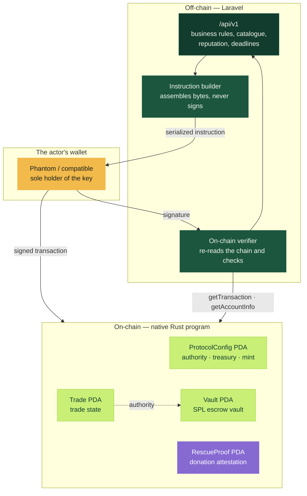
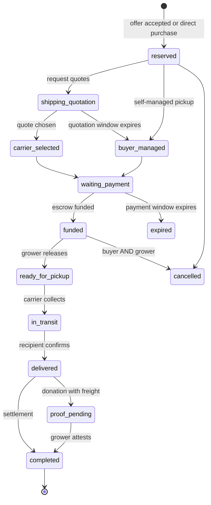
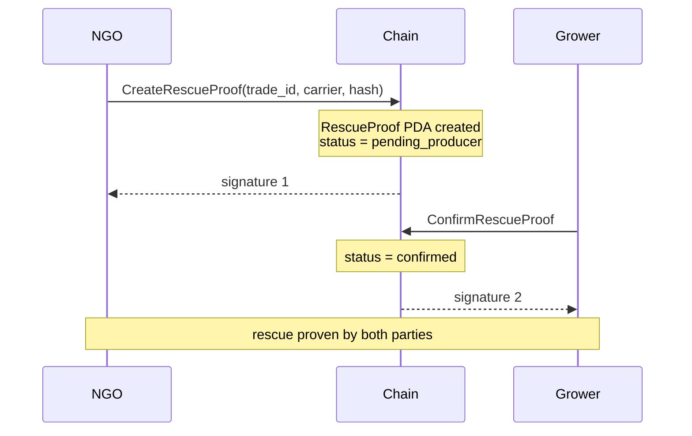

# FoodRescue — Whitepaper

**Custody without a custodian for agricultural surplus**

`v1.0` · MVP on Solana Devnet · September 2026

---

## Contents

1. [Waste is a trust problem](#1-waste-is-a-trust-problem)
2. [Thesis](#2-thesis)
3. [Protocol design](#3-protocol-design)
4. [The five actors](#4-the-five-actors)
5. [Life of a trade](#5-life-of-a-trade)
6. [Donation and the Proof of Rescue](#6-donation-and-the-proof-of-rescue)
7. [Protocol economics](#7-protocol-economics)
8. [Trust model](#8-trust-model)
9. [Out of scope for the MVP](#9-out-of-scope-for-the-mvp)
10. [Roadmap](#10-roadmap)

---

## 1. Waste is a trust problem

The FAO estimates that about a third of the world's food production is lost between harvest and plate.
In Brazil, a meaningful slice of that loss happens **before the farm gate**: the lot exists, it's good,
there's a willing buyer somewhere — and it rots anyway.

The bottleneck is rarely physical. It's contractual:

- **The grower** has a lot with a short window and no channel beyond the same handful of buyers.
- **The buyer** won't advance money to a seller they don't know, for goods they haven't seen.
- **The NGO** would take the donation, but can't promise anyone that the freight will be paid.
- **The carrier** won't roll without certainty of payment.

Four parties who all want the same deal, and none of them can afford to trust first. The classic
middleman resolves this by charging heavily and concentrating the risk — becoming, in the process, the
single point of failure and of margin capture.

## 2. Thesis

> **If nobody has to trust anybody, the deal happens.**

FoodRescue replaces interpersonal trust with a programmable guarantee. The value of the deal is locked
in an **on-chain vault with no custodian**: an account whose authority is an address derived
deterministically from the trade itself (a PDA), with no corresponding private key. Neither the
platform, nor the buyer, nor the grower can move that balance outside the rules written into the
program.

Three practical consequences:

1. **The buyer deposits without fear** — if delivery doesn't happen, cancellation returns everything.
2. **The grower ships without fear** — the money is locked before pickup.
3. **The carrier rolls without fear** — freight leaves the same vault, in the same settlement transaction.

And one structural consequence: **the platform stops being a risk**. It can't run off with the money
because it never held it.

## 3. Protocol design

The protocol has two halves with deliberately separated responsibilities.

**Off-chain (Laravel)** owns everything that would be expensive and churn-prone on chain: the product
and grading catalogue, marketplace search, offer negotiation, the freight quotation market, reputation,
operational deadlines, actor profiles. None of that needs global consensus.

**On-chain (native Rust program, no Anchor)** owns only what **must** be incontestable: who is entitled
to how much, under what condition, and the public record that the rescue happened. Four account types
and ten instructions — deliberately small, because every byte of on-chain surface is attack surface.

The seam between them is the **prepare → sign → verify** pattern:

1. The backend assembles the exact instruction and returns it to the front-end, with the expected
   addresses and amounts.
2. The actor's wallet signs. The server never sees a private key.
3. The backend receives the signature and **re-reads the chain**: it checks that the transaction exists
   and is confirmed, that it carries the right instruction over the right PDA, that it was signed by
   the parties it should have been, and that the resulting state matches field for field what was
   promised — including the amounts actually transferred.

Only then does the database advance. The byte-level detail of that verification lives in the
[Yellowpaper](YELLOWPAPER.md).

## 4. The five actors

| Actor | Brings | Receives |
|---|---|---|
| 🌱 **Grower** | The surplus, signed with their own wallet at publication | Product value minus 2% |
| 🛒 **Buyer** | The capital, locked in escrow before pickup | The lot, or the money back |
| 🚚 **Carrier** | A quote in an open market and the freight itself | 100% of the freight, no deduction |
| 🤝 **NGO** | Social distribution capacity and the cost of freight | The lot + a public proof of rescue |
| 🛡️ **Admin** | Reference catalogue, deadlines, `ProtocolConfig` | — |

Roles define permissions (RBAC via `spatie/laravel-permission`), but a role **never substitutes for an
ownership check**: holding the carrier role grants no access to someone else's trade; being a grower
grants no access to another grower's lot.

Each wallet is bound to an account by an **Ed25519 challenge** carrying a nonce, a purpose and an
expiry. Publishing a surplus requires signing again — the lot in the catalogue carries a cryptographic
commitment from whoever listed it.

## 5. Life of a trade

Three time windows govern the flow, all admin-configurable and swept by a scheduler every minute:

- **Freight quotation** (default 240 min) — on expiry the trade falls back to self-managed pickup
  rather than dying.
- **Payment** (default 15 min) — unfunded on expiry, the lot returns to the catalogue. Expiry is
  **reconciled against the chain** before it takes effect: if on-chain state exists, the backend does
  not expire the trade unilaterally.
- **Lot validity** — after it, the surplus leaves the storefront.

The point of no return is `ready_for_pickup`. Before it, cancellation returns everything to the buyer —
but once the escrow is funded it **requires both parties to sign**. Nobody unwinds alone a deal the
other side has already committed to.

## 6. Donation and the Proof of Rescue

A donation runs on the same rails with a product value of zero. If there's freight, the NGO funds only
the freight; settlement pays the carrier and nothing else.

What changes is the ending. A donation with freight doesn't close at `completed`: it moves to
`proof_pending` and only concludes once a **bilateral attestation** exists on chain.

Why two separate transactions instead of one with two signatures? Because the two parties sign at
different moments, on different machines — and a shared blockhash expires long before that happens. The
protocol accommodates operational reality rather than fighting it.

The attestation PDA is derived from `(trade_id, NGO wallet, grower wallet)`. Since `trade_id` is
predictable, putting both wallets in the seeds stops a third party from squatting the address: without
the NGO's signature nobody creates its proof, and without the grower's the attestation never leaves
"pending".

What gets recorded is not the sensitive data but a **SHA-256 hash** of a canonical document covering
lot, product, quantity, unit, parties and freight amount. Auditable by anyone holding the document,
opaque to anyone who doesn't.

## 7. Protocol economics

| Flow | Destination |
|---|---|
| Product − fee | Grower |
| 200 bps (2%) fee on the product | Protocol treasury |
| Full freight | Carrier |
| Vault surplus | Refunded to the buyer |

The fee applies **to the product only, never to freight** — taking a percentage of logistics would
penalise exactly the long routes that move food out of where it's piling up. And since donations carry
a product value of zero, **social rescue pays no fee at all**. The rule is enforced by the program, not
by the platform: an instruction whose fee diverges from the canonical calculation is rejected with
`InvalidFee`.

The vault distributes everything in a single atomic transaction. Either everyone is paid or nobody is
and the state doesn't advance — there is no scenario where the grower gets paid and the carrier is left
waiting.

The MVP's `FRUSD` is a devnet SPL token created for testing. **It does not represent real fiat
currency.** The design, however, is agnostic: any SPL mint registered in the `ProtocolConfig` works,
including a real stablecoin on an eventual mainnet.

## 8. Trust model

Who has to trust whom, and what happens when that trust fails:

| Trust | Scope | If it fails |
|---|---|---|
| **None** between buyer and grower | The entire financial flow | Nothing — the vault obeys neither of them |
| Platform as **coordinator** | Catalogue, negotiation, deadlines | Existing on-chain trades remain intact |
| `ProtocolConfig` authority | Sets treasury and mint | Misrouted fee; the escrow itself is unaffected |
| Human oracle: "it was delivered" | Delivery confirmation | See below |

The honest point about this design: **physical delivery has no cryptographic proof**. Whoever confirms
the goods arrived is the recipient, signing with their own wallet. The protocol guarantees the money
moves only when that confirmation exists and that it came from the right party — not that the truck
actually arrived. This isn't a flaw to hide: it's the intrinsic limit of any escrow over a physical
good. What can be done, and is done, is to make each step **attributable and public**, and to lean on
reputation accumulated over completed trades for the rest.

## 9. Out of scope for the MVP

Stated plainly, because a whitepaper that only promises is useless for making decisions:

- **Dispute arbitration.** There is no arbiter for "it arrived spoiled". Today the path is bilateral
  cancellation before pickup.
- **Partial delivery.** The lot is indivisible: the escrow settles whole or is refunded whole.
- **Mainnet and a real stablecoin.** `FRUSD` is devnet-only.
- **Immutable program.** The program's upgrade authority still exists; renouncing it is a mainnet
  decision.
- **Identity verification.** Documents and addresses are declared, not checked against an external
  source.

## 10. Roadmap

| Phase | Delivery |
|---|---|
| **Now** — devnet MVP | Full commercial and donation cycle on chain, bilateral Proof of Rescue, reputation, impact dashboards |
| **Next** — hardening | Cross-actor isolation tests across the whole money path, strong password policy, CSP, authorization unified into policies |
| **Then** — real pilot | Real stablecoin, renounced upgrade authority, external audit of the program |
| **Beyond** — scale | Arbitration with an elected arbiter, partial delivery, impact export for auditable ESG reporting |

---

**Less waste. More value and verifiable impact.**

[Yellowpaper — technical specification →](YELLOWPAPER.md)

