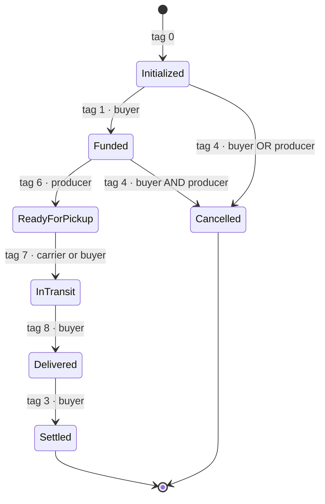
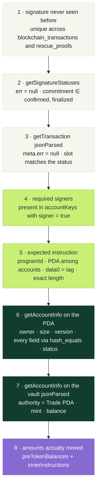

<div align="center">

# FoodRescue — Yellowpaper

**Technical specification of the Solana program and the verification protocol**

`Program v1` · `TradeState v2` · `RescueProofState v2` · `ProtocolConfig v1`

</div>

---

## Contents

1. [Conventions](#1-conventions)
2. [Program identity](#2-program-identity)
3. [Account model](#3-account-model)
4. [State layout](#4-state-layout)
5. [Instruction set](#5-instruction-set)
6. [On-chain state machine](#6-on-chain-state-machine)
7. [Fee arithmetic and distribution](#7-fee-arithmetic-and-distribution)
8. [Program invariants](#8-program-invariants)
9. [Off-chain verification protocol](#9-off-chain-verification-protocol)
10. [Wallet ownership protocol](#10-wallet-ownership-protocol)
11. [Error codes](#11-error-codes)
12. [Test vectors](#12-test-vectors)

---

## 1. Conventions

| Convention | Value |
|---|---|
| Integers | little-endian, no padding, no alignment |
| `u64` / `i64` | 8 bytes |
| `Pubkey` | 32 raw bytes; base58 only at the JSON boundary |
| Hash | SHA-256, 32 bytes |
| Serialization | manual, byte by byte — **no Borsh, no Anchor, no 8-byte discriminators** |
| Instruction discriminator | 1 byte (`data[0]`), followed by a fixed-size payload |
| Timestamps | `i64` Unix, from the `Clock` sysvar |
| RPC commitment | `confirmed` (configurable) |

The absence of Anchor is deliberate: the layout is public, stable and reproducible in any language
without an IDL. The PHP backend decodes exactly the bytes Rust writes, and a
[cross-compatibility test](#12-test-vectors) proves it.

## 2. Program identity

| | Devnet |
|---|---|
| Program ID | `Ex6CN32gBUH2JALUwbqyn8ZMwWmBNrrHa4sjDNMAm5sd` |
| `FRUSD` mint | `9tVPExJFkBU3yLgyo8fVzFVQj2t2boEESSpmoYikfxRr` |
| SPL Token Program | `TokenkegQfeZyiNwAJbNbGKPFXCWuBvf9Ss623VQ5DA` |
| System Program | `11111111111111111111111111111111` |
| Fee | `PROTOCOL_FEE_BPS = 200` (2.00%) |

Dependencies: `solana-program 2.2`, `spl-token 8.0` (`no-entrypoint`). About 1,370 lines of Rust.

## 3. Account model

Four account types, all PDAs — none of them has a private key.

| Account | Seeds | Owner | Size |
|---|---|---|---|
| **ProtocolConfig** | `"foodrescue_protocol"` ‖ `authority` | program | 98 B |
| **Trade** | `"foodrescue_trade"` ‖ `trade_id: u64 LE` ‖ `buyer` | program | 244 B |
| **Vault** | `"foodrescue_vault"` ‖ `trade_id: u64 LE` ‖ `buyer` | SPL Token | 165 B |
| **RescueProof** | `"foodrescue_rescue"` ‖ `trade_id: u64 LE` ‖ `ngo` ‖ `producer` | program | 147 B |

**Why the buyer's wallet is part of the Trade and Vault seeds.** `trade_id` comes from the database and
is sequential, therefore predictable. Were it the only seed, a third party could squat the address
ahead of the legitimate buyer and wedge the trade. With `buyer` in the derivation, only whoever
controls that wallet can create that PDA — address front-running ceases to exist.

The same reasoning applies to the RescueProof, which includes **both** attesting wallets.

**The Vault is an ordinary SPL Token account whose authority is the Trade PDA.** This is the core of
the thesis: moving the balance requires the program to sign with the trade's seeds, which only happens
inside `SettleTrade` or `CancelTrade`. No human — not even the platform admin — can produce that
signature.

## 4. State layout

### 4.1 `ProtocolConfig` — 98 bytes, `version = 1`

| Offset | Size | Field | Type |
|---:|---:|---|---|
| 0 | 1 | `version` | `u8` = 1 |
| 1 | 1 | `bump` | `u8` |
| 2 | 32 | `authority` | `Pubkey` |
| 34 | 32 | `treasury` | `Pubkey` |
| 66 | 32 | `mint` | `Pubkey` |

### 4.2 `TradeState` — 244 bytes, `version = 2`

| Offset | Size | Field | Type |
|---:|---:|---|---|
| 0 | 1 | `version` | `u8` = 2 |
| 1 | 1 | `trade_bump` | `u8` |
| 2 | 1 | `vault_bump` | `u8` |
| 3 | 8 | `trade_id` | `u64` |
| 11 | 32 | `buyer` | `Pubkey` |
| 43 | 32 | `producer` | `Pubkey` |
| 75 | 32 | `carrier` | `Pubkey` (zeros = no carrier) |
| 107 | 32 | `mint` | `Pubkey` |
| 139 | 32 | `vault` | `Pubkey` |
| 171 | 32 | `protocol_config` | `Pubkey` |
| 203 | 8 | `product_amount` | `u64` |
| 211 | 8 | `shipping_amount` | `u64` |
| 219 | 8 | `protocol_fee` | `u64` |
| 227 | 8 | `total_amount` | `u64` |
| 235 | 8 | `expires_at` | `i64` |
| 243 | 1 | `status` | `u8` |

`status`: `0` Initialized · `1` Funded · `2` Settled · `3` Cancelled · `4` ReadyForPickup ·
`5` InTransit · `6` Delivered

The state carries **every** party and **every** amount. Nothing needs to be cross-referenced with the
database to know who is owed what — the PDA is self-contained and auditable by third parties.

### 4.3 `RescueProofState` — 147 bytes, `version = 2`

| Offset | Size | Field | Type |
|---:|---:|---|---|
| 0 | 1 | `version` | `u8` = 2 |
| 1 | 1 | `bump` | `u8` |
| 2 | 8 | `trade_id` | `u64` |
| 10 | 32 | `producer` | `Pubkey` |
| 42 | 32 | `ngo` | `Pubkey` |
| 74 | 32 | `carrier` | `Pubkey` |
| 106 | 32 | `metadata_hash` | `[u8; 32]` |
| 138 | 8 | `created_at` | `i64` |
| 146 | 1 | `status` | `u8` |

`status`: `0` PendingProducer · `1` Confirmed

`metadata_hash` is the SHA-256 of the canonical JSON (`JSON_UNESCAPED_SLASHES | JSON_UNESCAPED_UNICODE`)
of:

```json
{ "version": 1, "trade_id": …, "surplus_lot_id": …, "product_id": …, "quantity": "…",
  "unit": "…", "producer_id": …, "ngo_id": …, "carrier_id": …, "shipping_amount": "…" }
```

## 5. Instruction set

Ten instructions. `data[0]` is the tag; the rest is a fixed-size payload — **any other size is
rejected**, which eliminates an entire class of deserialization attacks.

| Tag | Instruction | Payload | Total |
|---:|---|---:|---:|
| 0 | `InitializeTrade` | 104 B | 105 B |
| 1 | `FundTrade` | 0 | 1 B |
| 2 | `InitializeProtocol` | 32 B | 33 B |
| 3 | `SettleTrade` | 0 | 1 B |
| 4 | `CancelTrade` | 0 | 1 B |
| 5 | `CreateRescueProof` | 72 B | 73 B |
| 6 | `MarkReadyForPickup` | 0 | 1 B |
| 7 | `ConfirmPickup` | 0 | 1 B |
| 8 | `MarkDelivered` | 0 | 1 B |
| 9 | `ConfirmRescueProof` | 0 | 1 B |

### 5.1 `InitializeProtocol` — tag 2

Payload: `treasury: Pubkey` (32 B).

Accounts: `authority` (signer, writable) · `protocol_config` (writable) · `mint` · `system_program`

Creates the configuration PDA derived from the authority itself. Validates that the mint unpacks as an
SPL `Mint`. One authority per configuration; the operation is idempotent by address because creation
fails if the account already exists.

### 5.2 `InitializeTrade` — tag 0

| Offset | Size | Field |
|---:|---:|---|
| 0 | 8 | `trade_id` |
| 8 | 8 | `product_amount` |
| 16 | 8 | `shipping_amount` |
| 24 | 8 | `protocol_fee` |
| 32 | 8 | `expires_at` |
| 40 | 32 | `producer` |
| 72 | 32 | `carrier` (zeros when there is no freight) |

Accounts: `buyer` (signer, writable) · `trade_pda` (w) · `vault` (w) · `buyer_token` (w) ·
`protocol_config` · `mint` · `system_program` · `token_program`

**Preconditions enforced by the program:**

- `protocol_config` is owned by the program and its PDA re-derives from the `authority` it stores
- `protocol.mint == mint`
- `trade_pda` and `vault` match `find_program_address` over the canonical seeds
- `producer != 0` and `producer != buyer` — nobody trades with themselves
- `shipping_amount > 0 ⟹ carrier != 0`
- `protocol_fee == floor(product_amount × 200 / 10_000)`, otherwise `InvalidFee`
- `total_amount = product_amount + shipping_amount` via `checked_add`
- `total_amount != 0` and `expires_at > now`, otherwise `PaymentExpired`

**Effects:** creates the Trade PDA (244 B, owned by the program), creates the Vault (165 B, owned by
SPL Token), initializes the Vault via `initialize_account3` with the Trade PDA as authority, and writes
the state with `status = 0`.

### 5.3 `FundTrade` — tag 1

Accounts: `buyer` (signer) · `trade_pda` (w) · `buyer_token` (w) · `vault` (w) · `mint` · `token_program`

Requires `status == Initialized`, `state.buyer == buyer`, `now < expires_at`, and that both token
accounts unpack with the correct owner and mint. Re-derives Trade and Vault with
`create_program_address` from the bumps **stored in the state** — it does not trust what arrived in the
transaction.

Moves `total_amount` from `buyer_token` into the Vault via `transfer_checked` (which validates
decimals) and advances to `status = 1`.

### 5.4 `SettleTrade` — tag 3

Accounts: `buyer` (signer) · `trade_pda` (w) · `vault` (w) · `buyer_token` (w) · `protocol_config` ·
`producer_token` (w) · `treasury_token` (w) · `mint` · `token_program` · **`carrier_token` (w) — only when `shipping_amount > 0`**

Requires `status == Delivered` and `escrow.amount >= total_amount`. Checks the **owner** of every
destination account against the state: `producer_token.owner == state.producer`,
`treasury_token.owner == protocol.treasury`, `buyer_token.owner == state.buyer`,
`carrier_token.owner == state.carrier`. Forged token addresses do not get through.

Distributes in a single transaction, signing with the Trade PDA seeds:

```
producer_token   ← product_amount − protocol_fee     (if > 0)
treasury_token   ← protocol_fee                      (if > 0)
carrier_token    ← shipping_amount                   (if > 0)
buyer_token      ← escrow.amount − total_amount      (surplus, if > 0)
```

Then `status = 2`. The surplus refund exists because **anyone can transfer tokens into an SPL
account**: without it, an unsolicited deposit would be stuck in the vault forever.

### 5.5 `CancelTrade` — tag 4

Accounts: `buyer` · `producer` · `trade_pda` (w) · `vault` (w) · `buyer_token` (w) · `mint` ·
`token_program`

Only in `status ∈ {Initialized, Funded}`. The required signatures depend on the state:

| State | Signatures |
|---|---|
| `Initialized` (empty vault) | `buyer` **or** `producer` |
| `Funded` (vault holds money) | `buyer` **and** `producer` |

This is the most important rule in the protocol after the escrow itself: once the money is locked,
**neither party unwinds the trade alone**.

Verifies `escrow.amount >= (total_amount if Funded, else 0)` and refunds the vault's **entire
balance** — not just `total_amount` — for the same reason as the settlement surplus: an unsolicited
transfer must not be able to block cancellation. Then `status = 3`.

### 5.6 `MarkReadyForPickup` / `ConfirmPickup` / `MarkDelivered` — tags 6, 7, 8

Accounts: `actor` (signer) · `trade_pda` (writable). That's all — these are pure state transitions with
no token movement.

| Tag | Transition | Signer |
|---:|---|---|
| 6 | `Funded → ReadyForPickup` | `state.producer` |
| 7 | `ReadyForPickup → InTransit` | `state.carrier`, or `state.buyer` when `carrier == 0` |
| 8 | `InTransit → Delivered` | `state.buyer` (the recipient) |

Delivery is always confirmed by the **recipient**, never by whoever transports it — the party with an
interest in attesting receipt is the same one who unlocks payment.

### 5.7 `CreateRescueProof` — tag 5

| Offset | Size | Field |
|---:|---:|---|
| 0 | 8 | `trade_id` |
| 8 | 32 | `carrier` |
| 40 | 32 | `metadata_hash` |

Accounts: `ngo` (signer, writable) · `producer` · `protocol_config` · `rescue_pda` (w) ·
`system_program`

The grower **does not sign here** — they appear only as a key in the seeds and in the state. Rejects
`ngo == producer` and `metadata_hash == 0`. Creates the PDA with `status = 0` (pending the grower).

### 5.8 `ConfirmRescueProof` — tag 9

Accounts: `producer` (signer) · `rescue_pda` (writable)

Requires `status == PendingProducer` and `state.producer == producer`. Re-derives the PDA with the
stored bump. Advances to `status = 1`.

Two transactions instead of one with two signatures, because the parties sign at different moments on
different machines and a shared blockhash would expire in between.

## 6. On-chain state machine



Transitions missing from the diagram are impossible: every instruction compares `state.status` against
the exact expected value and returns `InvalidState` otherwise. There is no backward transition, no path
from `Delivered` to `Cancelled`, and `Settled` / `Cancelled` are terminal.

## 7. Fee arithmetic and distribution

```rust
pub const PROTOCOL_FEE_BPS: u64 = 200;

pub fn protocol_fee(product_amount: u64) -> u64 {
    ((product_amount as u128 * PROTOCOL_FEE_BPS as u128) / 10_000) as u64
}
```

The multiplication widens to `u128` before dividing — no overflow is possible for any `u64`, and
rounding is **always down, in the grower's favour**. The value arrives in the instruction from the
backend, but the program recomputes it and rejects any divergence with `InvalidFee`: the fee is not
negotiable at the edge.

Sums use `checked_add` / `checked_sub` with `ArithmeticOverflow`. The backend performs the same
calculation with `brick/math` over decimals and converts to the mint's base units, verifying that the
declared precision can represent the value — a `product_amount` with more decimal places than the mint
supports is refused before it ever reaches the chain.

| Party | Formula |
|---|---|
| Grower | `product_amount − protocol_fee` |
| Treasury | `protocol_fee` |
| Carrier | `shipping_amount` |
| Buyer (surplus) | `escrow.amount − total_amount` |
| **Sum** | `escrow.amount` — the vault empties completely |

## 8. Program invariants

Properties the program maintains under any sequence of instructions:

1. **The vault only moves inside `SettleTrade` or `CancelTrade`.** Its authority is the Trade PDA, and
   the seed signature is produced on those two paths only.
2. **Every PDA derivation is re-verified** — with `find_program_address` at creation, then with
   `create_program_address` from the bumps stored in the state. No account passed in the transaction is
   accepted at the address it claims.
3. **Every token account's owner is checked against the state**, never against the input.
4. **The distributed sum is exactly the vault balance.** No dust left behind, no value trapped.
5. **`total_amount` never changes after `Initialize`** — written once, read thereafter.
6. **An unsolicited deposit wedges nothing**: the surplus returns at settlement, the entire balance
   returns at cancellation.
7. **No transition skips a state.** `from` is compared for exact equality.
8. **Deadlines come from the chain, not the client**: `expires_at` is compared against the `Clock`
   sysvar.

## 9. Off-chain verification protocol

The backend never believes a signature merely because it was presented. Every confirmation passes
through this sequence before any database write — all of it inside a transaction holding
`SELECT … FOR UPDATE` on the trade.



**Step 5 — the expected instruction.** The verifier walks the transaction's instructions looking for
one whose `programId` matches, with the PDA among its accounts, `data[0] == tag` and a length
**exactly** equal to the table in section 5. A transaction that runs the wrong instruction, or the
right one over a different PDA, does not pass.

**Step 6 — re-reading the state.** Compared field by field against what was promised at preparation
time: `trade_id`, `buyer`, `producer`, `carrier`, `mint`, `vault`, `protocol_config` (keys compared
with `hash_equals` over raw bytes), the four monetary values, `expires_at`, and `status`, which must be
exactly the one expected for that operation. A version other than 2, or a size other than 244, is
refused before any field is read.

**Step 8 — the money that actually moved.** Reading the final state is not enough to know how much was
transferred. At settlement the backend locates the vault in `meta.preTokenBalances` (matching
`accountIndex`, `mint` and `owner == trade_pda`) and requires a prior balance ≥ `total_amount`; the
difference is recorded as a surplus refund. At cancellation it goes further: it finds the cancel
instruction, reads the `innerInstructions` at that index, sums every `transferChecked` whose `source`
is the vault and whose `authority` is the Trade PDA, and requires that sum to cover the prior balance.
Tokens that arrived earlier in the same transaction do not escape the check.

**RPC failures never become success.** A network error or a malformed response yields `502`, never a
state advance.

## 10. Wallet ownership protocol

Binding a wallet to an account requires proving possession of the private key by an Ed25519 signature
over a server-issued message.

```
FoodRescue Wallet Verification
Version: 1
Purpose: <registration | verify | surplus_publication>
Wallet: <base58>
User ID: <id>              ← absent for the registration purpose
Nonce: <uuid v4>
Issued At: <ISO-8601 UTC>
Expires At: <ISO-8601 UTC>
```

| Property | Rule |
|---|---|
| Verification | `sodium_crypto_sign_verify_detached(sig, message, pubkey)` |
| Signature | 64 bytes, carried as base64 |
| Public key | 32 bytes, decoded from base58 |
| TTL | 5 min by default, clamped to `[1, 30]` |
| Use | **single** — `used_at` written under `FOR UPDATE` |
| Scope | purpose, wallet and `user_id` checked together |

The purpose is part of the signed message, so a signature obtained to change wallets cannot be replayed
to publish a surplus. When a new wallet is verified, every pending challenge for that user is
invalidated at once, and `solana_wallet_address` uniqueness is guaranteed by a database unique index in
addition to the in-code check.

Publishing a surplus consumes a `surplus_publication` challenge: the lot in the catalogue carries a
cryptographic commitment from whoever listed it.

## 11. Error codes

Returned as `ProgramError::Custom(n)`.

| n | Error | Meaning |
|---:|---|---|
| 0 | `InvalidInstruction` | Unknown tag or payload of the wrong size |
| 1 | `InvalidPda` | Address does not match the canonical derivation |
| 2 | `InvalidAccount` | Wrong signer, writability or program |
| 3 | `InvalidState` | State version or `status` incompatible with the transition |
| 4 | `InvalidFee` | Fee diverges from `floor(product × 200 / 10_000)` |
| 5 | `PaymentExpired` | Deadline passed, or zero total at initialization |
| 6 | `ArithmeticOverflow` | `checked_add` / `checked_sub` failed |
| 7 | `InvalidTokenAccount` | SPL account owner, mint or balance mismatch |

## 12. Test vectors

The binary layout is verified from both ends by fixtures **generated by Rust and read by PHP**.

`solana/examples/export_layout.rs` serializes the three states with known values and writes
`solana/fixtures/{trade,protocol,rescue}.bin`. The same files live in `www/tests/Fixtures/Solana/`, and
`RustLayoutCompatibilityTest` asserts that the PHP decoder extracts exactly the values Rust wrote:

```
trade.bin     244 B   trade_id 42 · bumps 254/253 · product 100,123,456
                      freight 12,345,678 · fee 2,002,469 · total 112,469,134
                      expires_at 2_000_000_000 · status 1 (Funded)
protocol.bin   98 B   version 1 · bump 250
rescue.bin    147 B   version 2
```

A layout change on either side breaks the test on the other. That is what keeps this specification and
the code from drifting apart silently.

| Suite | Where |
|---|---|
| Solana program | `cd solana && cargo test` (`tests/program.rs`, `tests/validation.rs`) |
| Backend | `cd www && composer test:php` |
| Front-end | `cd www && npm test` |
| Devnet E2E | `cd solana && npm run pagar / entregar / liquidar` |

---

<div align="center">

[← Whitepaper](WHITEPAPER.md) · [Functional documentation](../www/docs/)

</div>
